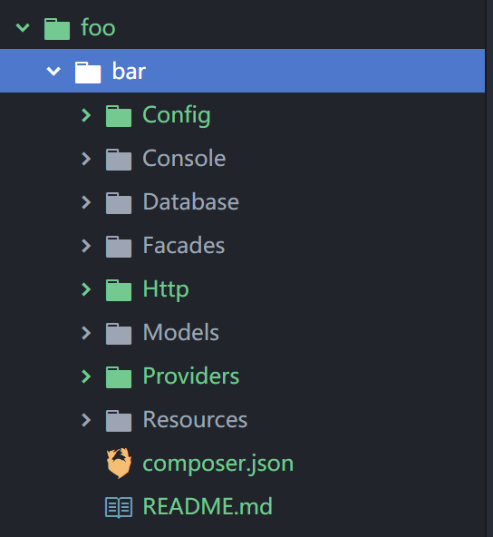

<h1 align="center"> Package Maker </h1>

<p align="center"> :package: A composer laravel package maker.</p>


# 安装方式


```shell
$ composer global require shineyork/laravel-package-maker:dev-master

或者

$ composer global require shineyork/laravel-package-maker

```

# 命令目录

```shell
 $ laravel-package-Maker
```

## 创建项目的命令

```
laravel-package-maker build [项目名 => name/com]
```

## 需要自行完善

例如:
```shell
laravel-package-maker build foo/bar

Name of package (example: foo/bar): foo/bar
Namespace of package [Foo\Bar]:
Description of package:
Author name of package [shineyork]:
Author email of package [shineyork@sixstaredu.com]:
License of package [MIT]:
laravel service provider name : FooServiceProvider
Package foo/bar created in: ./foo/bar
```



如上就是目录结构,那么需要自行修改的内容

1. ``Http\Controllers\Controller.php``中的命名空间
2. ``Providers\FooServiceProvider.php``中的命名空间和类名


## 备注

1.0 很low 很多功能没有完善,主要是快捷创建基础文件<br>
请静候2.0
